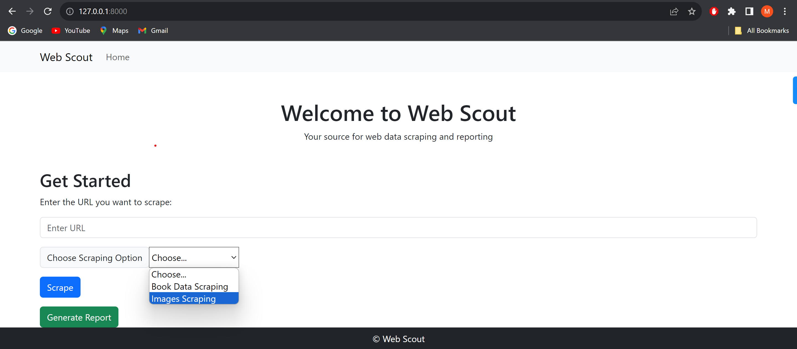
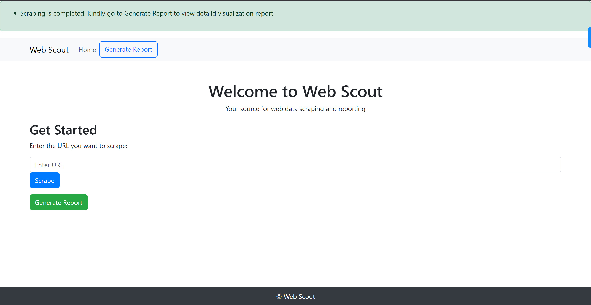
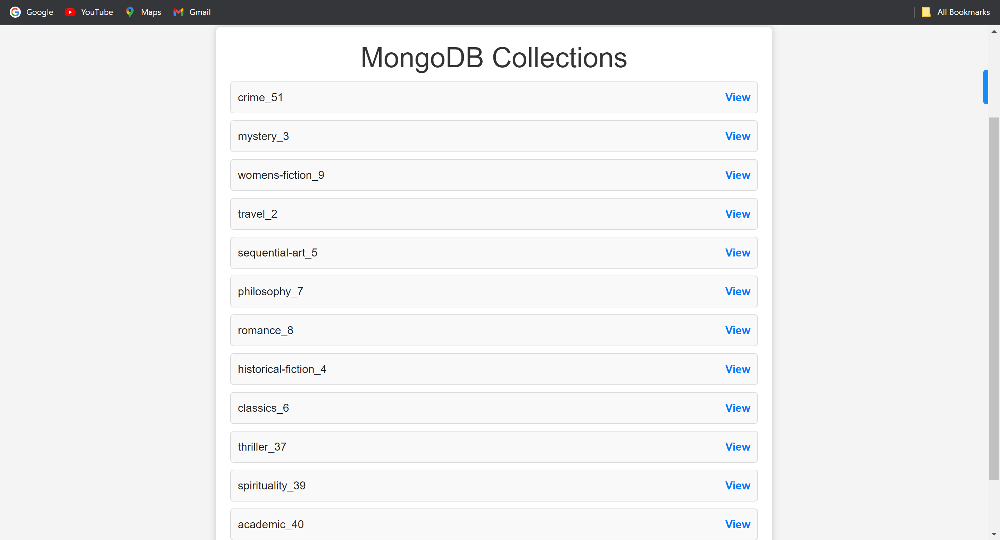
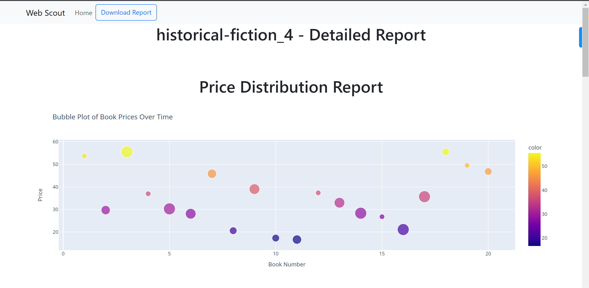
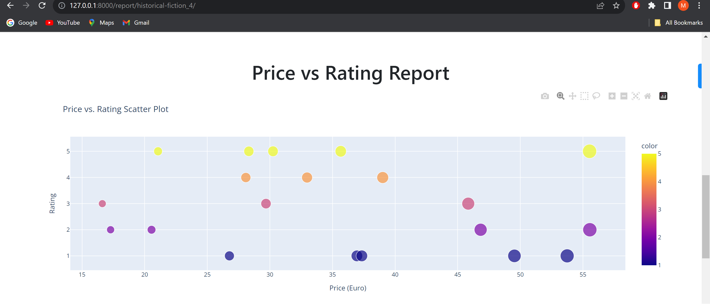
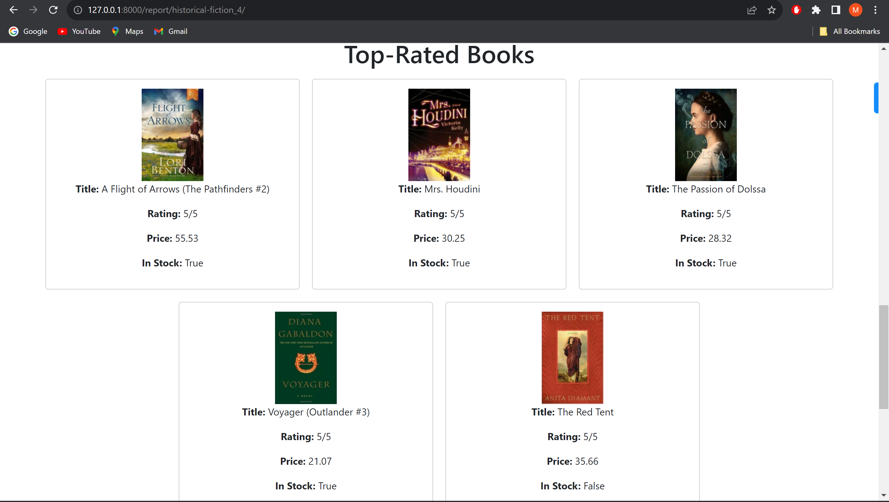
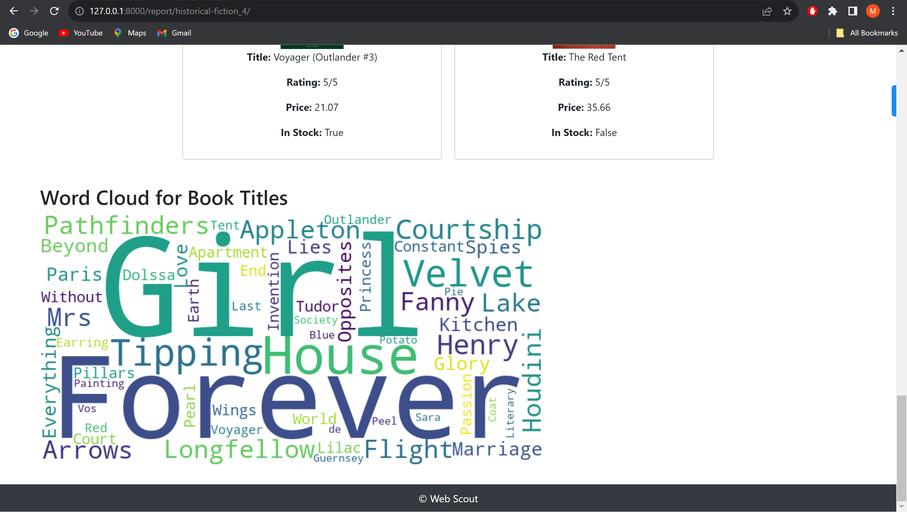

# Web-Scout

## Table of Contents

- [About](#about)
- [Screenshots](#screenshots)
- [Technologies Used](#technologies-used)
- [Contributing](#contributing)
- [Installation](#installation)
## About
WebScout is a powerful web scraping and data visualization tool built using Scrapy and Django. It allows users to extract data from website [source](https://books.toscrape.com/index.html) and Images from [Getty Imges portal](https://www.gettyimages.de/), store it in a MongoDB database, and generate detailed reports with visualizations.

Web scraping is a common technique used for various purposes, such as market research, competitive analysis, or data collection for research projects. WebScout simplifies the process by providing an easy-to-use web interface for scraping data from websites. Users can simply input the URL of the target website, and WebScout will handle the rest.

Key features of WebScout include:

- **Web Scraping**: WebScout utilizes Scrapy, a popular Python web crawling framework, to scrape data from websites efficiently.

- **Data Storage**: Scraped data is stored in a MongoDB database, making it easy to retrieve and analyze.

- **Data Visualization**: WebScout offers various data visualization options using Plotly, allowing users to gain insights from the collected data.

- **Report Generation**: Users can generate comprehensive reports that include charts, graphs, and word clouds based on the scraped data.

## Screenshots
Homepage:
  
  
Message after scrapping:
  
  
List of mongoDB Collections created  after each scrapping: 
 
  
Detailed Report:
 
  

  

  

  



  

## Technologies Used

WebScout is built using the following technologies and libraries:

- Django: A Python web framework for building web applications.
- Scrapy: A Python web crawling and scraping framework.
- MongoDB: A NoSQL database for storing scraped data.
- Plotly: A data visualization library for creating interactive charts and graphs.
- Pandas: A data manipulation library for Python.
- ReportLab: A library for generating PDF reports.
- Other Python libraries for web development and data processing.

WebScout combines the power of these technologies to provide a seamless web scraping and data analysis experience.

## Contributing

We welcome contributions from the open-source community to help improve and expand WebScout's functionality. If you'd like to contribute, please refer to the [Contribution Guidelines](LICENSE) in the project repository for more information on how to get started.

## Installation

To get started with WebScout, follow these installation steps:
1. **Connect to a mongoDB cluster and note the uri, it will be neede to connect to the cluster.**
1. **Clone the Repository:**

   Clone the WebScout repository to your local machine using Git:

   ```bash
   git clone https://github.com/mohdUwaish59/Web-Scout.git
2. **Get into the directory:**
   ```bash
   cd Web-Scout
3. **Configure Virtual environment:**
   ```bash
   virtualenv WebScout_Env
4. **Activate the virtual environment:**
   ```bash
   For Windows
   WebScout_Env/Scripts/Activate
5. **Install Dependencies and run server:**
   ```bash
   pip install -r requirements.txt
   python manage.py runserver
6. **Set up mongoDB uri and paste it in book spider and GettyImages spider at thier respetive places**
7. **Run the web server**
  ```bash
   python manage.py runserver
   


